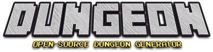

# <p align="center"></p>

A configurable and editable dungeon generator using Binary-Space Partitioning and hand-made rooms running in the browser.


## 🕹️ Testing

A demo is available here https://halftheopposite.github.io/dungeon.

## 💻 Running

If you want to run the development mode to **generate** dungeons or **edit** rooms you can run the `yarn start` command.

This will launch the development server where you will be able to:

- Edit rooms at http://localhost:3000/#/edit/
- Generate dungeons at http://localhost:3000/#/generate/

## 📕 Features

### Editor

Using the **edit** mode you can: create, edit, or remove the rooms that are used for generating dungeons. The current editing session is saved to the local storage which makes it possible to continue editing later on.

- You can **load** a `rooms.json` file to start with.
- You can **save** a `rooms.json` to use in your own project.


### Generator

In the **generate** mode, you can render dungeons by tuning some key parameters.

- You can **download** a JSON representation of the dungeon.
- You can **right click** and save the generated image.


## ⚙️ How to use the generator's code in your own project?

```typescript
import { generate } from '@halftheopposite/dungeon';

const dungeon = generate({
  rooms: [...], // A list of templates (e.g. `rooms.json` from the editor)
  mapWidth: 96,
  mapHeight: 56,
  mapGutterWidth: 1,
  iterations: 5,
  containerSizeRatio: 0.45,
  roomSpawnChance: 0.9,
  corridorWidth: 2,
});
```

This will return:

```typescript
{
    width: number;
    height: number;
    tree: TreeNode<Container>;
    layers: {
        tiles: TileMap;
        props: TileMap;
        monsters: TileMap;
    };
}
```

## Assets

Thanks to [@pixel_poem](https://twitter.com/pixel_poem) for the art package he published on https://pixel-poem.itch.io/dungeon-assetpuck.

## Licenses

This project is under the [MIT](https://github.com/halftheopposite/dungeon/blob/main/LICENSE) license.
