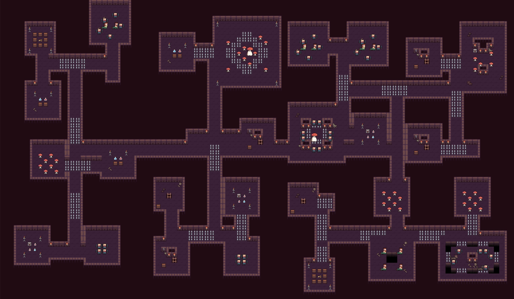
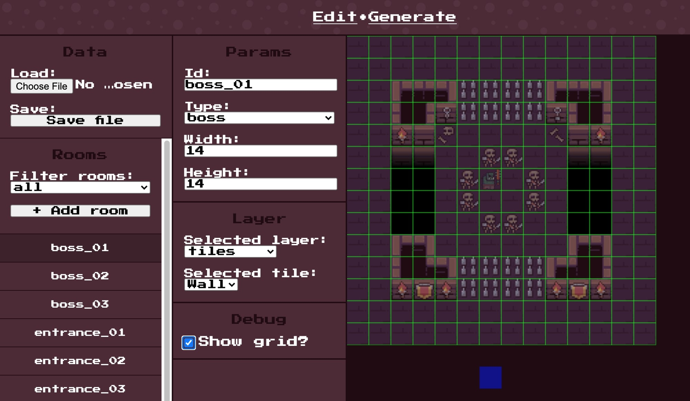
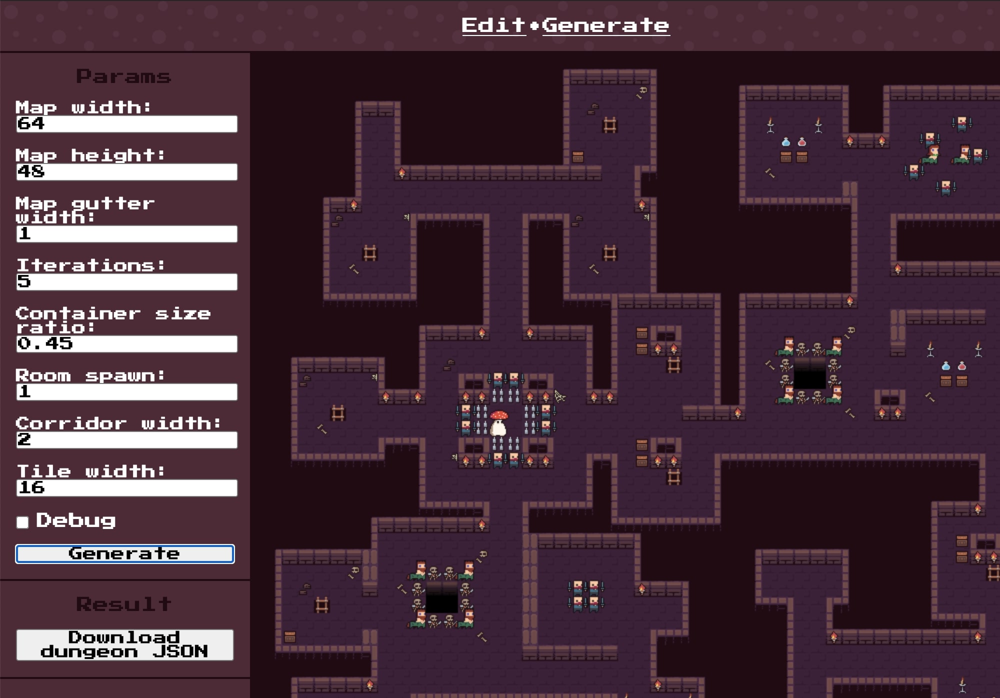

# dungeon

A configurable and editable dungeon generator using Binary-Space Partitioning and hand-made rooms.

You can use it here https://halftheopposite.github.io/dungeon.



## Running

If you want to get the development mode running to generate dungeons or edit rooms:

```
yarn
yarn start
```

This will launch the development server (using `express.js`):

- Edit rooms at http://localhost:3000/#/edit/
- Generate dungeons at http://localhost:3000/#/generate/

## Edit

Using the **edit** mode you can: create, edit, or remove the rooms that are used for generating dungeons. The current editing session is saved to the local storage which makes it possible to continue editing later on.

- You can **load** a `rooms.json` file to start with.
- You can **save** a `rooms.json` to use in your own project.



## Generate

In the **generate** mode, you can render dungeons by tuning some key parameters.

- You can **right click** and save the generated image.
- You can **download** a JSON representation of the dungeon.



## Want to use the dungeon generation algorithm in you project?

You can copy the content of the `/src/generate/` folder into your project and call it like so:

```typescript
import { generate } from "./dungeon";

const dungeon = generate({
  rooms: [...],
  mapWidth: 96,
  mapHeight: 56,
  mapGutterWidth: 1,
  iterations: 5,
  containerSizeRatio: 0.45,
  roomSpawnChance: 0.9,
  corridorWidth: 2,
});
```

This will return:

```typescript
{
    width: number;
    height: number;
    tree: TreeNode<Container>;
    layers: {
        tiles: TileMap;
        props: TileMap;
        monsters: TileMap;
    };
}
```

## Assets

Thanks to [@pixel_poem](https://twitter.com/pixel_poem) for the art package he published on https://pixel-poem.itch.io/dungeon-assetpuck.

## Licenses

This project is under the [MIT](https://github.com/halftheopposite/dungeon/blob/main/LICENSE) license.
